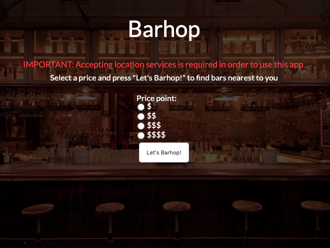

Name of project: Barhop
Link to live app: https://heuristic-yalow-4e6f7e.netlify.com/
Screenshots:
<<<<<<< HEAD

=======

>>>>>>> f1ae0eca21973d4579da9d2ca57c5313c034d47c
Summary: Barhop is an application which allows the user to locate the nearest bar based on a specific price point. The app displays business details in a list sorted by distance (nearest to furthest) from user's coordinates. The user view the business's website and navigate to their location through Google Maps. Once at the bar, the user can choose to "barhop" to another location or call it a night and call an Uber. 
Technology used: HTML/CSS/JavaScript/jQuery/AJAX
